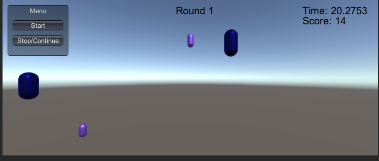
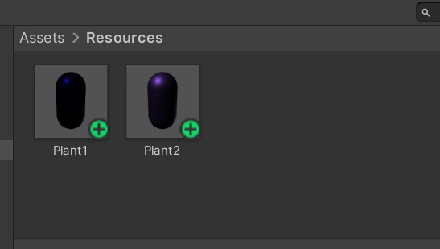

# 鼠标打飞碟游戏（Hit UFO)

## 任务要求

### 1.游戏有n个round，每个round都包括10次trial；
### 2.每个trial的飞碟的色彩、大小、发射位置、速度、角度、同时出现的个数都可能不同。它们由该round的ruler控制；
### 3.每个trial的飞碟有随机性，总体难度随round上升；
### 4.鼠标点中得分，得分规则按颜色、大小、速度不同计算，规则可自由设定。

## 游戏设计
1. 本游戏使用MVC框架、工厂模式和泛型单实例。

2. 飞盘的设计上分为两种外观，一种紫色的较小，一种蓝色的较大。而速度则在1到5之间。这些飞盘会随机从上方某位置落下。

3. 不同的飞盘有不同的分值，飞盘分值计算公式为：score = speed * Multiple。关于Multiple（倍数），紫色为二倍，蓝色为一倍。

4. 本游戏设计为 2 round，第一回合，过关分数为50，第二回合过关分数为80，除此之外，第二轮飞盘下降的速度会略微上升。以此，实现了难度的加大。

5. 本游戏计时30秒，在游戏中，玩家可以选择暂停或重新开始。

效果图如下：



## 预制
设计预制如下图所示，预制保存在了Resources文件夹里，方便后面调用。

## 代码

1. DiskAction

该部分代码为添加到预制飞碟上的Component，提供了Disk是如何运动的。
```
public class DickAction : MonoBehaviour
{
    public int speed;
    public int score;
    static DiskFactory fc;
    void Start()
    {
        speed = (int)Random.Range(1,6);
        score = (int)speed;
        fc = Singleton<DiskFactory>.Instance;
    }

    // Update is called once per frame
    void Update()
    {
        if(this.transform.position.y<-7){
            fc.FreeDisk(this.transform.gameObject);
            return;
        }
        if(fc.statue==1) this.gameObject.transform.Translate(new Vector3(0,-1,0)*this.speed*Time.deltaTime);
    }
}
```
2. DiskFactory

Disk工厂，产生和回收Disk实体，实现了工厂模式。
```
public class DiskFactory : Singleton<DiskFactory>
{
    List<GameObject> used = new List<GameObject>();
    List<GameObject> free = new List<GameObject>();
    public int statue=0;
    public int level=0;
    public GameObject getDisk(){
        GameObject a;
        if(free.Count>0){
            a = free[0];
            free.Remove(a);
        }
        else{
            int t = (int)Random.Range(1,3);
            if(t==1) {
                a = Instantiate(Resources.Load("Plant1"),
            new Vector3(Random.Range(-12,12),7,0), Quaternion.identity, null) as GameObject;
                a.GetComponent<DickAction>().speed+=level;
            }
            else{
                a = Instantiate(Resources.Load("Plant2"),
            new Vector3(Random.Range(-12,12),7,0), Quaternion.identity, null) as GameObject;
                a.GetComponent<DickAction>().speed+=level;
                a.GetComponent<DickAction>().score*=2;
            }
        }
        used.Add(a);
        return a;
    }
    public void FreeDisk(GameObject b){
        b.SetActive(true);
        b.transform.position = new Vector3(Random.Range(-12,12),7,0);
        b.GetComponent<DickAction>().score /= b.GetComponent<DickAction>().speed;
        b.GetComponent<DickAction>().speed = (int)Random.Range(1,5)+level;
        b.GetComponent<DickAction>().score *= b.GetComponent<DickAction>().speed;
        used.Remove(b);
        free.Add(b);
    }
    public void ClearDisk(){
        GameObject a;
        while(used.Count>0){
            a = used[0];
            used.Remove(a);
            Destroy(a);
        }
        while(free.Count>0){
            a = free[0];
            free.Remove(a);
            Destroy(a);
        }
    }
}
```
3. Singleton

该部分代码为泛型单实例，使用了课上讲解的模板。
```
public class Singleton<T> : MonoBehaviour where T : MonoBehaviour
{
    protected static T instance;
    public static T Instance{
        get{
            if(instance == null){
                instance = FindObjectOfType (typeof(T)) as T;
                if(instance == null){
                    Debug.LogError("An instance of"+typeof(T)+
                    "is needed in the scence,but there is none.");
                }
            }
            return instance;
        }
    }
```
4. MyController

本游戏的Controller，实现了游戏中需要的各种操作。
```
public class MyController : MonoBehaviour,ISceneController,IUserAction
{
    int Gamestatue = 0;
    float diskNum = (float)0.4;
    public GameObject cam;
    public int score=0;
    DiskFactory fcc;
    void Awake(){
        SDirector director = SDirector.getInstance();
        director.currentScenceController = this;
        fcc = Singleton<DiskFactory>.Instance;
    }
    public void LoadResources(){
    }
    public int StartGame(){
        fcc.ClearDisk();
        Gamestatue = 1;
        fcc.statue = Gamestatue;
        score = 0;
        return Gamestatue;
    }
    public int GameOver(){
        Gamestatue = 2;
        fcc.statue = Gamestatue;
        return Gamestatue;
    }
    public int Pause(){
        if(Gamestatue!=2){
            Gamestatue = 1-Gamestatue;
            fcc.statue = Gamestatue;
        }
        return Gamestatue;
    }
    public void Setlevel(int round){
        fcc.level = round;
    }
    public void HitDel(){
        if(Input.GetButtonDown("Fire1")){
            Vector3 mp = Input.mousePosition;
            Camera ca;
            if(cam!=null) ca = cam.GetComponent<Camera>();
            else ca = Camera.main;

            Ray ray = ca.ScreenPointToRay(Input.mousePosition);

            RaycastHit[] hits = Physics.RaycastAll(ray);

            foreach(RaycastHit hit in hits){
                hit.transform.gameObject.SetActive(false);
                fcc.FreeDisk(hit.transform.gameObject);
                score+=hit.transform.gameObject.GetComponent<DickAction>().score;
                diskNum--;
            }
        }
    }
    public int ScoreCount(){
        return score;
    }

    void Update()
    {
        if(Gamestatue==1) HitDel();
        diskNum+=Time.deltaTime;
        if(diskNum>=0.4&&Gamestatue==1){
            fcc.getDisk();
            diskNum = 0;
        }
        
    }
}
```
5. IUserAction

IUserAction接口。
```
public interface IUserAction{
    int StartGame();
    int Pause();
    int GameOver();
    int ScoreCount();
    void Setlevel(int round);
}
```
6. UserGUI

该部分完成了用户交互界面。
```
public class UserGUI : MonoBehaviour
{
    private IUserAction action;
    int score = 0;
    float time = 30;
    GUIStyle style,bigstyle;
    string gameMessage = "";
    int round = 1;
    int statue=0;
    void Start()
    {
        action = SDirector.getInstance().currentScenceController as IUserAction;

        style = new GUIStyle();
        style.normal.textColor = Color.white;
        style.fontSize = 70;

        bigstyle = new GUIStyle();
        bigstyle.normal.textColor = Color.black;
        bigstyle.fontSize = 20;
    }
    void OnGUI(){
        GUI.Box(new Rect(10,10,120,100), "Menu");
        if(GUI.Button(new Rect(20,40,100,20), "Start")){
            statue = action.StartGame();
            time = 30;
            score = 0;
            gameMessage = "";
        }
        if(GUI.Button(new Rect(20,70,100,20), "Stop/Continue")){
            statue = action.Pause();
        }
        if(gameMessage == "Next round"){
            if(GUI.Button(new Rect(300,100,180,60), "Continue")){
                action.Setlevel(round);
                statue = action.StartGame();
                time=30;
                gameMessage = "";
                round++;
            }
        }
        GUI.Label(new Rect(370, 200, 180, 200), gameMessage,style);
        GUI.Label(new Rect(Screen.width - 150,10,100,50), "Time: " + time, bigstyle);
        GUI.Label(new Rect(Screen.width - 150,30,100,50), "Score: " + score, bigstyle);
        GUI.Label(new Rect(Screen.width - 400,10,100,50), "Round " + round, bigstyle);
    }
    void Update()
    {
        score = action.ScoreCount();
        if(time<=0) {
            if(round==1){
                if(score>50) gameMessage="Next round";
                else gameMessage="Game Over";
            }
            else {
                if(score>40*round) gameMessage="You Win!!!";
                else gameMessage="Game Over";
            }
            statue = action.GameOver();
            time=0;
        }
        if(statue==1) time-=Time.deltaTime;
    }
}

```
## 效果展示

视频见该网址：https://live.csdn.net/v/254270

